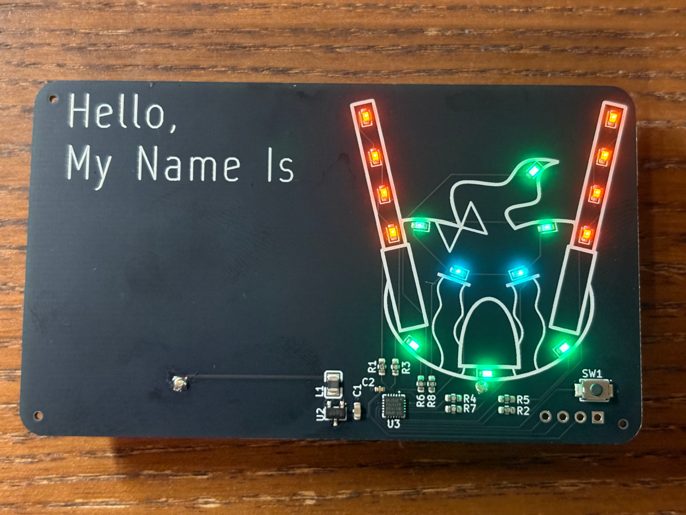

#+title: Wisp Light-up Nametag

This repository contains the PCB design and software for the light up
nametag I will be giving out at Offkai Expo 2026. 

* Usage
** Battery

*NOTE: Please be very careful to insert the battery with the correct polarity in the battery holder. Failure to do so may result in destruction of the device*

The Badge is powered by a 1.5V AAA battery. While I have not tested it, it should be compatible with rechargable AAA cells or lithium rechargable cells, provided the battery voltage is below 3 volts.

While powered down, the badge draws a small amount of current from the battery at all times. When storing the badge for long periods of time (weeks-months), please remove the battery so as to avoid draining the battery or causing it to leak.

*** User Interface

- Tap the button on the bottom right to change the blink pattern
- Press and hold the button on the bottom right for about 2 seconds, then release to enter brightness mode. The LEDs will stop blinking and remain on continuously
- When in brightness mode, tap the button to change the brightness
- To exit brightness mode, press and hold the button for about 2 seconds, then release. The LEDs should begin blinking again
- To power off the device, press and hold the button until the LEDs turn off
- To power the device back on, tap the button again

* Manufacture

** Hardware
The PCBs I made were ordered from [[https://jlcpcb.com][JLCPCB]], through their PCB Assembly
service. The design files under the [[https://github.com/xchgeaxeax90/wisp-nametag/releases/tag/v2.0][v2.0 Manufacturing Files]] release
can be uploaded to JLCPCB's automatic quote system to order either
bare PCBs or assembled boards.

*** Parts

The Bill of Materials is below. When viewing the BOM from Kicad, the JLCPCB/LCSC part ids should be taken as the reference, some of the part numbers in the schematic are incorrect

| Part Name            | Designator              | Comment                                     |
|----------------------+-------------------------+---------------------------------------------|
| TZ-P2-0603GTCS1-0.6T | D9,D10,D11,D12,D13,D14  | 0603 SMD LED – Emerald Green 520nm          |
| TS-1088-AR02016      | SW1                     | 3.9x3.0mm SPST Momentary Button             |
| CL10A226MQ8NRNC      | C1                      | 0603 22uf ceramic capacitor                 |
| MPL2016S2R2MHT       | L1                      | 0806 2.2 uH inductor                        |
| BL8536CB3TR36        | U2                      | 0.9V-3.3V Ultra Low Voltage Boost Converter |
| 0603WAF470JT5E       | R1,R2                   | 0603 47 Ohm Resistor                        |
| STC8H1K08-36I-QFN20  | U3                      | STC8H1K08 24MHz microcontroller             |
| CL05B104KO5NNNC      | C2                      | 0402 100nF Capacitor                        |
| LTST-C190KFKT        | D1,D2,D3,D4,D5,D6,D7,D8 | 0603 SMD LED – Orange 605nm                 |
| SMLD12E3N1WT86       | D15,D16                 | 0603 SMD LED – Cyan 496nm                   |
| 0603WAF3000T5E       | R3,R4,R5,R6,R7,R8       | 0603 300 Ohm Resistor                       |

Note: If manufacturing this yourself, consider using the
SMLD12E2N1WT86 505nm Blue-Green LED in place of the 520 Emerald Green
LED. It looks much closer to mint green, but is much more difficult
and expensive to source

** Software

The software loaded on the badges I gave (or will give) out can be
found at the [[https://github.com/xchgeaxeax90/wisp-nametag/releases/tag/v2.0-software][v2.0 Software]] release. This contains the entire source
code as well as prebuilt binaries that can be loaded directly onto the
boards.

*** Programming

The microcontroller can be programmed using a 3.3V USB to UART cable and the [[https://github.com/grigorig/stcgal][STCGal programmer software]].

1. Completely remove power from the board. The board cannot just be put to sleep using the button, it must be entirely powered off, with the battery removed
2. Connect the microcontroller's TX and RX pins to the UART. These pins can be found on the programming header on the bottom left of the PCB when viewed from the back. If you're good, you can likely do this by just shoving pins in the holes instead of soldering them in place.
3. Start =stcgal=, replacing =/dev/ttyUSB0= with your USB to UART's serial port device 
   
#+BEGIN_SRC bash
  stcgal -p /dev/ttyUSB0 -P stc8g --trim 24000 path/to/app.hex
#+END_SRC

4. Power on the board - I like to use alligator clips to clip directly on to the battery terminals, but you can also just insert the battery

5. The programmer should automatically begin downloading the code to the microcontroller

